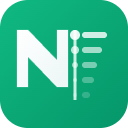

#  Notion Recent URL

Advanced Chrome Extension for managing recently accessed Notion pages and databases with powerful search, favorites, and smart organization features.

## ✨ Features

### Core Functionality
- **📋 Recent Files Display** - View recently accessed Notion pages and databases
- **🔍 Smart Search** - Real-time search across page titles and URLs
- **📌 Pin/Favorite System** - Pin frequently used pages for quick access
- **🌐 Favicon Integration** - Display website favicons alongside page titles

### Advanced Filtering & Sorting
- **🎯 Content Type Filters** - Filter by All, Pages, or Databases
- **📊 Multiple Sort Options**:
  - Recent (最新順)
  - Access Frequency (アクセス頻度順)
  - Alphabetical (アルファベット順)
  - Pinned Priority (ピン留め優先)
- **⭐ Pinned-Only View** - Toggle to show only pinned items

### Smart Organization
- **🏷️ Auto-categorization** - Automatic detection of pages vs databases
- **🧹 Title Cleanup** - Removes "| Notion" suffixes automatically
- **📈 Usage Analytics** - Highlights frequently visited pages
- **⚡ Performance Optimized** - Handles 200+ recent items efficiently

### User Experience
- **🎨 Notion-Inspired Design** - Clean, modern interface matching Notion's aesthetic
- **📱 Responsive Layout** - Works on different screen sizes
- **🔥 Hover Interactions** - Smooth animations and visual feedback
- **⌨️ Keyboard Friendly** - Full keyboard navigation support

## 🚀 Installation

1. Clone this repository
2. Run `npm install` to install dependencies
3. Run `npm run build` to build the extension
4. Load the `build` folder as an unpacked extension in Chrome

## 🛠️ Development

```bash
# Install dependencies
npm install

# Build for development with source maps
npm run build

# Watch for changes during development
npm run watch

# Build for production (optimized)
npm run prod

# Format code
npm run format
```

## 📋 Usage

### Basic Navigation
1. Click the extension icon to open the popup
2. Browse through tabs: **ALL**, **Pages**, **Databases**
3. Click any item to open it in a new tab

### Search & Filter
1. **Search**: Type in the search box to filter by title or URL
2. **Sort**: Use the dropdown to change sorting order
3. **Pin Filter**: Click the pin button to show only pinned items

### Pin Management
1. **Pin a Page**: Hover over any item and click the pin icon
2. **Unpin**: Click the pin icon again to remove from favorites
3. **View Pinned**: Pinned items appear at the top with special styling

### Smart Features
- **Auto-Detection**: Databases are automatically identified and marked
- **Clean Titles**: "| Notion" suffixes are automatically removed
- **Usage Tracking**: Frequently accessed pages are highlighted with ↗
- **Favicon Display**: Each page shows its website favicon

## 🔧 Technical Details

### Architecture
- **Chrome Extension Manifest V3** - Modern extension architecture
- **Webpack Build System** - Optimized bundling and development
- **TailwindCSS** - Utility-first CSS framework
- **ES6+ JavaScript** - Modern JavaScript features

### APIs Used
- **Chrome History API** - Accessing browsing history
- **Chrome Storage API** - Storing user preferences and pins
- **Google Favicon Service** - Retrieving website favicons

### Data Sources
- Recent Notion pages from Chrome history
- User preferences stored locally
- Favicon data from Google's service

## 🎯 Upcoming Features

- **🔄 Sync Across Devices** - Chrome sync integration
- **📊 Advanced Analytics** - Usage patterns and insights
- **🏷️ Custom Tags** - User-defined tags and categories
- **🔔 Smart Notifications** - Reminders for important pages
- **🤖 AI Integration** - Content recommendations
- **📤 Export/Import** - Backup and share configurations

## 🤝 Contributing

Suggestions and pull requests are welcomed!

### Development Guidelines
1. Follow the existing code style
2. Test on multiple screen sizes
3. Ensure Chrome Manifest V3 compliance
4. Update documentation for new features

## 📄 License

MIT License - see LICENSE file for details

## 🙏 Acknowledgments

- Inspired by the original Google Drive Recent Files extension
- Built with modern web technologies
- Designed with Notion's user experience principles

---

**Made with ❤️ for Notion power users**
